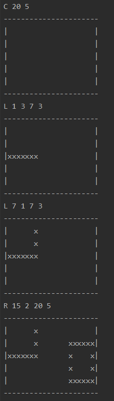

# Command Line Drawing Application

This application allows user to draw a console and then draw lines and rectangles
the console. Users will have to enter the co ordinates of the lines or the 
rectangles as input through the command line which is used to draw those shapes.

1. User can draw a console by entering the following command "Shape_Name Shape_Width Shape_Height"
     Here the Shape_Name value has to be "C"
2. User can draw Lines or Shapes by entering the following command "Shape_Name x1 y1 x2 y2"
     Here the Shape_Name value can either be "L" for Lines or "R" for Rectangle.
     And x1, y1, x2 and y2 are the x and y co-ordinates depicting the length or breadth of the shape
3. User has to make sure the line or rectangle co-ordinates stay with in the console boundary.
4. Also user has to provide the Console details before drawing line or rectangle co-ordinates
5. User can quit the application by entering "Q".

Below examples show how the output looks for each type of user inputs

#### To create the jar file
Run "mvn clean package"

#### To run the executable
Run "java -jar target/command-line-drawing-1.0.jar"
